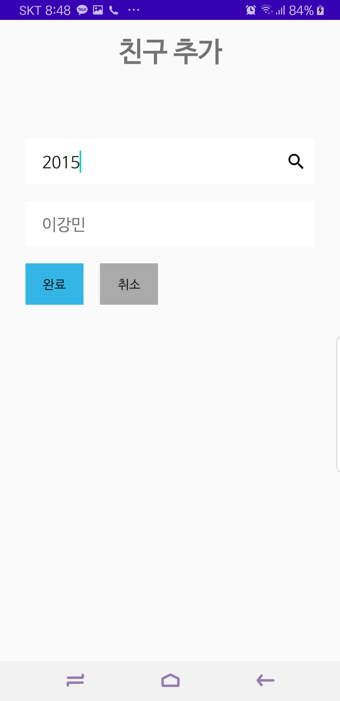

# 우리 지금 만나
2020 한이음 ICT 멘토링 참가 프로젝트 - 비콘을 활용한 약속장소 산출 어플리케이션

## Description
- 사용자들의 출발 위치를 수집하여 중간 지점을 계산하고 약속 장소 추천
- 약속 장소로의 경로 추천
- 사용자들의 이동 현황 조회
- 약속 장소에 설치된 비콘으로 도착 정보의 정확도 개선

## Task
- [x] 회원가입, 로그인, 로그아웃
- [x] 지도 API 추가
- [x] 현재 위치 표시
- [x] 장소 검색 결과 지도에 표시
- [x] 친구 신청, 친구 초대 수신
- [x] 약속 파티 개설
- [ ] 약속 장소 추천
- [ ] 약속 장소로의 경로 추천
- [ ] 사용자들의 실시간 위치 표시
- [ ] 비콘 연동

## Screenshots
   

## Tech / Framework / Library
* Beacon
* Android
* Java
* T map API
* Socket.IO